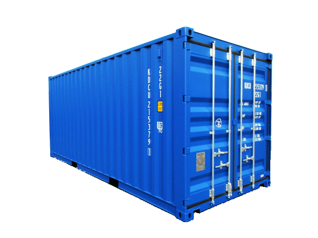

### **도커는 컨테이너 기술로서 컨테이너를 만들고 관리하기위한 도구**

```
컨테이너는 표준화된 소프트웨어 단위이다.
코드와 코드 실행 환경을 패키지화 해놓은 것 ex) NodeJs code + NodeJS runtime
즉, 어디서든 누가 실행시키든 동일한 nodeJS 코드와 도구, 버전을 제공할 수 있다.
```

<br/>

### 컨테이너 예시
---
- **피크닉 바구니**
<br/><br/>


피크닉 가방엔 음식, 식기도구 등 피크닉에 필요한 모든것들이 들어있다. 

그래서 피크닉 가방만 있으면 먹고 싶은 곳 어디에서든 피크닉을 즐길 수 있다.

---

- **컨테이너**
<br/><br/>



Docker의 컨테이너 개념은 선박이나 트럭에 적재해서 옮기는 컨테이너에서 나왔다.

컨테이너 안에는 다양한 상품들을 담아서 옮기는데, 하나의 컨테이너는 독립적이고 고립되어있다.
즉, 다른 상품과 섞이지 않고, 컨테이너를 적재할 수 있는 곳이면 어디든 적재해서 옮길 수 있다.

<br/>

--- 

위의 예시와 같이 컨테이너는 필요한 모든것들이 갖추어진 하나의 독립적인 단위로서, 실행 코드와 코드 실행에 필요한 종속성을 패키지로 묶은 소프트웨어 단위라고 볼 수 있다.

그리고 Docker가 설치되어 있는 어느곳이든 이 컨테이너를 사용할 수 있다.
컨테이너 안에 모든 필요한 것들이 들어있기 때문에, 환경에 구애받지 않고 동일한 애플리케이션을 실행시킬 수 있다.

**그래서 도커는 컨테이너에 대한 생성과 관리를 단순화하는 도구이다.**