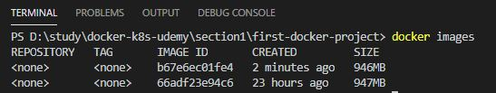

# node.js와 도커를 사용한 첫번째 연습

## 디렉토리 구조


<br/>
<br/>

* app.mjs
```javascript
import express from 'express';
import connectToDatabase from './helpers.mjs'

const app = express();

app.get('/', (req, res) => {
    res.send('<h2>Hi there!</h2>');
});

await connectToDatabase();

app.listen(3000);
```
루트 url로 요청 시, 간단한 html을 반환하는 서버. (3000 포트)

<br/>
<br/>

* helpers.mjs
```javascript
const connectToDatabase = () => {
    const dummyPromise = new Promise((resolve, reject) => {
        setTimeout(() => {
            resolve();
        }, 1000);
    });

    return dummyPromise;
};

export default connectToDatabase;
```
데이터베이스 연결 dummy 코드. (node.js 14.3 버전 이상에서 작동하는 코드)   
도커에서 node.js 14버전으로 지정.


<br/>
<br/>

* package.json
```javascript
{
  "name": "first-docker-project",
  "version": "1.0.0",
  "description": "first docker practice",
  "main": "app.mjs",
  "scripts": {
    "test": "echo \"Error: no test specified\" && exit 1"
  },
  "author": "",
  "license": "ISC",
  "dependencies": {
    "express": "^4.17.1"
  }
}

```
express lib 종속성 관리를 위한 package.son

<br/>
<br/>

* Dockfile
```Docker
# node.js를 기본 이미지로 사용
FROM node:14

# 컨테이너의 파일 시스템 지정. (모든 컨테이너에는 자체 파일 시스템이 존재)
# 파일 시스템에 디렉토리를 지정.
WORKDIR /app

# WORKDIR 디렉토리에 package.josn을 복사
COPY package.json .

# npm install 명령 실행. 
RUN npm install

# 지정한 위치의 파일들을 다 복사. (app.mjs, helpers.mjs)
COPY . .

# 3000 포트로 연다. (app.mjs에서 3000포트로 수신하기 때문에)
EXPOSE 3000

# node 명령으로 app.mjs를 실행.
CMD ["node", "app.mjs"]
```

<br/>
<br/>

## 도커 이미지 빌드 및 실행
프로젝트 디렉토리에서 실행을 기준 CMD 터미널에서 명령어 실행.

1. 도커 파일을 기반으로 이미지 빌드   
**docker build .**


<br/>
<br/>

2. 도커 이미지 확인   
**docker images**


<br/>
<br/>

3. 도커 이미지 ID로 컨테이너 실행.   
**docker run [option] [image ID]**

"-p 3000:3000"은 로컬호스트의 3000포트를 컨테이너의 3000포트와 바인딩
<br/>
<br/>


<br/>
<br/>

4. 실행중인 컨테이너 종료.   
**docker ps**   
**docker stop [ps name]**


