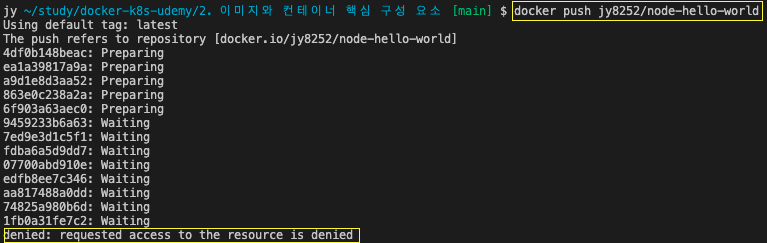

# 이미지 DockerHub에 푸시

이미지를 공유할 때, 도커의 매커니즘은 이미지 파일 자체를 공유하는 것이 아니라 저장소를 통해 올리고 내려받는 git과 같은 매커니즘을 사용한다.  
이미지를 공유하는 장소에는 2가지 장소가 있는데, 개인 저장소와 Docker Hub 저장소가 있다. 

Docker Hub는 기본적으로 공개 저장소로 무료로 사용할 수 있으며, 비용을 지불하고 비공개 저장소로 사용할 수 있다.
만약 Docker Hub외에 다른 비공개 저장소를 사용하고 싶다면, 가격이나 정책이 provider마다 다르기 때문에 확인하고 이용하고 싶은 provider와 계약해서 사용하면 된다. 
그리고 git과 비슷하게 저장소에 이미지를 push해서 저장하고 로컬로 저장소의 이미지를 가져올땐 pull 명령을 사용한다. 
Docker Hub는 당장 시험해볼 수 있는 환경과 무료라는 장점이 있기 때문에 저장소 작업이 처음이라면 Docker Hub 로 작업을 시작해보는 것이 좋다.

  

작업을 하기 전에 Docker Hub에 회원가입을 해야한다.
[Docker Hub](https://hub.docker.com/)

## Docker Hub에 이미지 push

* 저장소 만들기

create Repository 버튼을 클릭한다.  

자징서 이름을 입력하고 Create 버튼을 클릭해서 저장소를 만든다.  

만들어진 저장소를 확인할 수 있다. 오른쪽의 Docker commands를 보면 push 명령어를 복사해서 사용할 수 있다.

   

* 저장소에 이미지 push

이제 복사한 push 명령을 사용해보자.

push를 하기전에 Docker Hub의 저장소 이름과 image의 이름을 맞춰주어야한다. 

위에서 저장소의 이름을 node-hello-world라고 지었고, 아이디는 jy8252이다. 그래서 이미지의 이름을 jy8252/node-hello-world라고 똑같이 지정해주어야 한다.  

그리고 push를 해보면 accedd denied 로 접근할 수 없다. 당연하게도 내가 만든 저장소에 모든 사람들이 push를 할 수 없어야 한다. 그래서 로그인을 하고 권한을 얻어야 한다.  

DockerHub의 계정으로 로그인한다  

그리고 다시 push를 해보면 정상적으로 동작한다. 이때 node 이미지를 기반으로 이미지를 빌드했다면, node 이미지까지 전부 다 포함해서 저장소에 push하는것이 아니라 node 이미지에 대한 연결을 설정만하고 push하진 않는다.  

Docker Hub의 저장소를 확인하면 push 기록을 확인할 수 있다.

