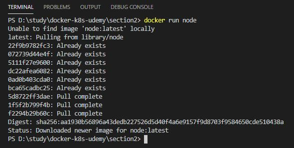
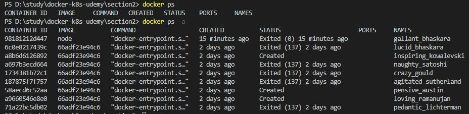
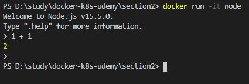

## 외부에서 미리 만들어진 이미지 사용.

이미지의 공유와 재사용성의 특징으로, 외부에서 미리 만들어진(같은 팀의 동료이거나 커뮤니티) 이미지를 이용해 컨테이너를 실행시킬 수 있다.

<br/>
<br/>

## Docker Hub
[Docker Hub](https://hub.docker.com/) 사이트는 미리 만들어진 이미지들을 npm 처럼 모아놓은 도커를 위한 세계 최대의 커뮤니티 사이트이다.

<br/>
<br/>

## Docker Hub에 있는 node 이미지로 컨테이너 실행하기

* **옵션 없이 node 이미지 실행**
```Docker
docker run node
```

<br/><br/>
명령어를 입력하고 2번째 라인을 보면 로컬에는 node 이미지가 없다고 나온다. 로컬에서 먼저 이미지를 찾고 없으면 Docker Hub 커뮤니티에서 이미지를 찾고 가져와서 컨테이너를 실행한다.

<br/>
<br/>
<br/>

* **도커 컨테이너 실행 이력(실행중 or 종료) 확인**
```Docker
docker ps -a
```

<br/><br/>
docker ps는 단순히 실행중인 컨테이너를 보여주는 명령이지만 옵션으로 "-a" 를 주면 이미 종료된 컨테이너 내역도 함께 출력된다. 제일 최근 이력에 node를 실행시켰지만 바로 종료되었는데, node 자체로는 실행시켰을때 아무것도 할 수 있는것이 없다.


<br/>
<br/>
<br/>

* **대화형 쉘 입력 옵션으로 node 이미지 실행**
```Docker
docker run -it node
```

<br/><br/>
옵션으로 "-it"를 주면 컨테이너 내부에서 호스팅 시스템간에 대화형 세션 연결할 수 있다.
그럼 컨테이너 내부의 node와 함께 컨테이너가 계속 실행중인 상태가 된다. <br/>
2번째 줄을 보면 컨테이너는 Docker Hub의 node 이미지에 정의된 node 버전 v15.5.0으로 실행됨을 알 수 있다. 따라서 컨테이너를 실행중인 호스트 시스템과 무관하게 컨테이너는 독자적으로 node를 실행시키고 있음을 알 수 있다.


