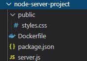

## Dockerfile로 이미지 빌드

Dockerfile은 이미지를 만들 때, Docker에 대한 명령들을 포함한다.

<br/>

### node 기반 앱 이미지
<br/>

* 디렉토리 구조



<br/>
<br/>
<br/>

* server.js 소스코드

```javascript
const express = require('express');
const bodyParser = require('body-parser');

const app = express();

let userGoal = 'Learn Docker!';

app.use(
  bodyParser.urlencoded({
    extended: false,
  })
);

app.use(express.static('public'));

app.get('/', (req, res) => {
  res.send(`
    <html>
      <head>
        <link rel="stylesheet" href="styles.css">
      </head>
      <body>
        <section>
          <h2>My Course Goal</h2>
          <h3>${userGoal}</h3>
        </section>
        <form action="/store-goal" method="POST">
          <div class="form-control">
            <label>Course Goal</label>
            <input type="text" name="goal">
          </div>
          <button>Set Course Goal</button>
        </form>
      </body>
    </html>
  `);
});

app.post('/store-goal', (req, res) => {
  const enteredGoal = req.body.goal;
  console.log(enteredGoal);
  userGoal = enteredGoal;
  res.redirect('/');
});

app.listen(80);

```

<br/>
<br/>

* Dockerfile 설정

```Dockerfile
FROM node
# 다른 이미지를 기반으로 이미지를 구축한다. ("node"라는 이미지를 기반으로)
# 로컬시스템 또는 Docker 허브에서 해당 이름의 이미지를 찾음.
# 로컬에 없고 Docker허브에 있으면 처음 컨테이너를 실행 후, 이미지를 다운받아서 저장해놓는다.

WORKDIR /app
# 명령이 실행되는 디렉토리를 지정한다. (아래에서 설명)

COPY . /app
# 로컬에 있는 파일들을 이미지로 옮기는 명령.
# 첫번째 경로 : 컨테이너 외부, 두번째 경로 : 이미지 내부의 경로
# COPY . /app 은 Dockerfile 와 같은 경로상의 모든 파일들을 이미지 상의 /app 디렉토리 안으로 복사한다.

RUN npm install
# RUN은 이미지내의 working 디렉토리에서 실행시킬 명령을 지시한다.
# 실행되는 명령의 기본 디렉토리는 루트 디렉토리이다.
# 하지만 WORKDIR을 지정하면 그 디렉토리에서 실행된다. (위의 설정으로 인해 /app에서 실행하게 된다.)

EXPOSE 80
# 컨테이너에서 특정 포트를 로컬 시스템에 노출시킨다.
# 예를 들어, 노드 앱 서버가 80포트로 시작되도록 설정되어있다면, 컨테이너에서도 80포트를 열어줘야한다.

CMD ["node", "server.js"]
# 컨테이너를 실행시켜서 node앱 서버를 실행.
# RUN node server.js 은 이미지를 생성할때 실행시키지만, CMD는 생성된 이미지를 컨테이너가 시작될 때 한다된다.

```


