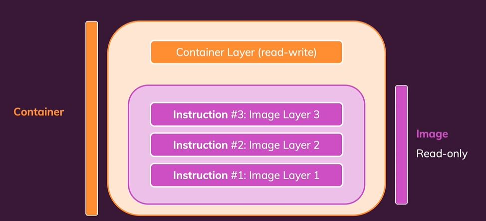
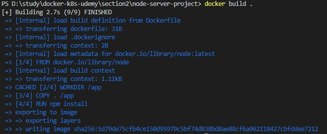
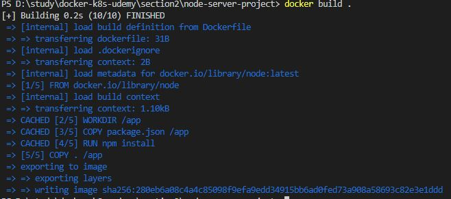

# 이미지는 레이어 기반이다.

이미지를 Dockerfile로 빌드하고 나면, Dockerfile의 각 명령어에 대한 결과가 캐싱이 된다. 그래서 리빌드를 할 때, 수정된 것이 없다면, 캐싱된 결과를 통해 빠르게 이미지를 빌드하게 된다. <br/>
이렇게 `하나하나의 캐싱된 결과(Dockfile로 치면 하나의 명령어)를 레이어`라고 하는데, 이 레이어들은 각각 독립적으로 저장되며 읽기 전용이기 때문에 수정할 수가 없다. 따라서 변경이 감지된 레이어부터는 캐싱된 결과가 아닌 새로 명령을 실행시켜서 새로운 결과를 가지고 이미지를 빌드하게 된다.<br/>

빌드된 이미지를 컨테이너로 실행시키면, 이미지를 빌드하면서 생성된 레이어들 위에 컨테이너 레이어가 생성되서 실행되는 구조이다.



<br/><br/>

아래는 빌드했을때의 결과이다.


위의 그림을 보면 실행된 명령 앞에 CACHED라고 캐싱을 사용해서 빌드했다는 것을 알 수 있다.

<br/><br/>

## Dockerfile을 최적화

```Dockerfile
FROM node

WORKDIR /app

COPY . /app

RUN npm install

EXPOSE 80

CMD ["node", "server.js"]

```
위의 dockerfile은 소스코드를 수정할때마다 npm install을 새로 시작하게된다. 그 이유는 "COPY . /app" 명령어 이후에 npm install을 하기 때문이다. <br/>
그래서 만약 소스코드를 수정하고 리빌드를 할 때, 도커는 파일의 내용이 변경되었음을 감지하고 "COPY . /app" 명령부터 그 뒤의 명령들까지 전부 새로 실행하게 된다. (레이어 기반)<br/>

<br/>


위의 그림에서 "COPY . /app" 명령부터는 캐시가 적용되지 않은 것을 볼 수 있다.

<br/><br/>


따라서 종속성 라이브러리를 관리하는 package.json은 자주 바뀌지 않기때문에, 아래처럼 dockerfile을 바꿔주는것이 좋다.


```Dockerfile
FROM node
WORKDIR /app
COPY package.json /app
RUN npm install
COPY . /app
EXPOSE 80
CMD ["node", "server.js"]
```
npm install 명령을 위로 앞당겼다. 그래서, 소스코드의 내용이 변경되더라도 npm install은 캐싱된 결과를 통해 빌드될 것이다.

<br/>


