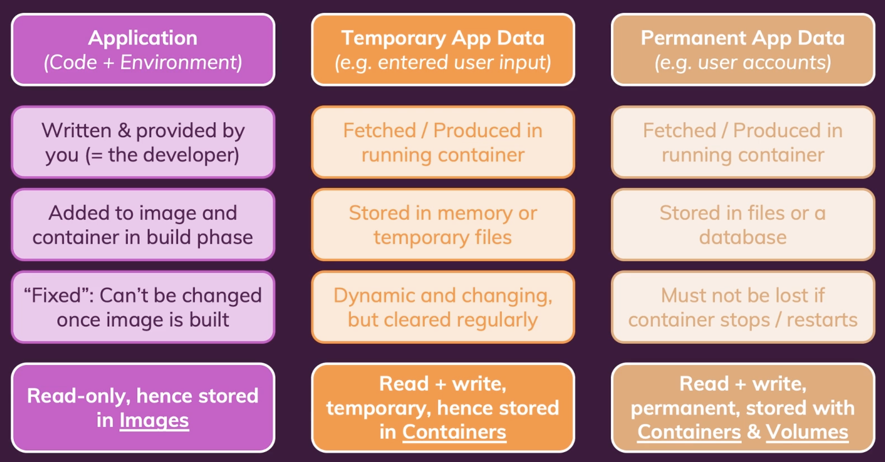
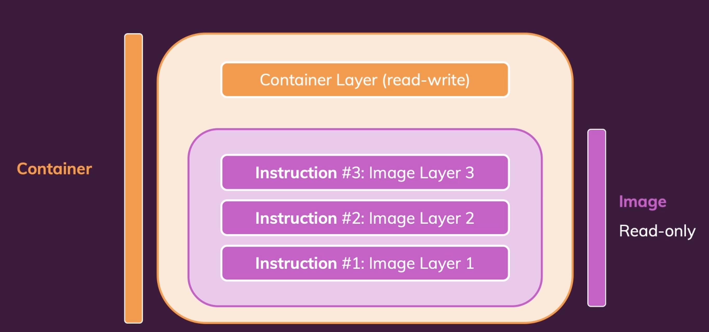

Docker와 컨테이너를 사용할때 이용하게 되는 데이터의 종류에는 3가지가 있다.

  

1. 애플리케이션 (소스 코드 + 구동 환경) - Image Layer

개발자가 작성한 소스코드나 환경(종속성 라이브러리, 애플리케이션 구동에 필요한 관련된 모든 것 등) 에 대한 데이터이다. 이 데이터들은 이미지로 빌드되고나면 변경할 수 없는 데이터들이다. 왜냐하면 이미지는 레이어로 구성되어 있고, 이 레이어들은 read-only 이기 때문이다.

그림과 같이 컨테이너는 이미지 레이어 위에 각 컨테이너의 레이어가 올라가는 형태로 실행된다. 이미지의 레이어는 불변의 성질이고 이미지 레이어는 각 이미지당 하나씨만 존재한다. 즉, 하나의 이미지 레이어를 여러 컨테이너가 같이 쓰는것이다.

  

2. 임시 애플리케이션 데이터 - Container Layer

애플리케이션 동작 과정에서 발생하는 임시 데이터들이다. 예를 들면, 웹사이트에서 텍스트박스에 사용자가 입력을 하면 소스코드상의 어떤 변수(메모리)에 저장될 것이다. 또는 임시 파일에 저장할 수도 있다. 이 데이터들은 일시적인 데이터들로, 컨테이너의 입장에서 크게 중요하지 않은 데이터들이다. 컨테이너에 종료될 때, 없어져도 되는 데이터들인데 이 데이터들은 이미지의 레이어가 아닌 컨테이너의 레이어에 저장된다. 

  

3. 영구적인 애플리케이션 데이터 - Volume Container

영구적인 데이터들로 컨테이너의 실행과 종료에 관계없이 존재해야하는 데이터들이다. 예를 들어 데이터베이스에 저장된 사용자 계정과 같은 데이터들이다. 이 데이터들은 볼륨 컨테이너에 저장될 것이다.