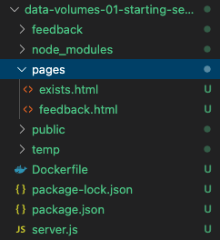

# 데이터 관리와 볼륨 작업에 대한 node 앱 구조

## directory



작업을 위한 2개의 페이지와 디렉토리가 존재. feedback.html에서 제목과 내용을 입력할 수 있는 입력란이 있고, 저장을 하면 feedback 폴더에 내용이 입력된 해당 제목의 txt파일 저장. 하지만, 같은 이름의 제목을 다시 입력하면 exists.html로 리다이렉트 된다. 이땐 temp 폴더에 파일이 저장된다.<br/>
아래는 feedback 페이지이다.


<br/><br/><br/>

## source
```javascript
const fs = require('fs').promises;
const exists = require('fs').exists;
const path = require('path');

const express = require('express');
const bodyParser = require('body-parser');

const app = express();

app.use(bodyParser.urlencoded({ extended: false }));

app.use(express.static('public'));
//feedback폴더 접근 가능
app.use('/feedback', express.static('feedback'));

//get feedback.html
app.get('/', (req, res) => {
  const filePath = path.join(__dirname, 'pages', 'feedback.html');
  res.sendFile(filePath);
});

//get exists.html
app.get('/exists', (req, res) => {
  const filePath = path.join(__dirname, 'pages', 'exists.html');
  res.sendFile(filePath);
});

//파일을 저장
app.post('/create', async (req, res) => {
  //제목
  const title = req.body.title;
  //내용
  const content = req.body.text;

  const adjTitle = title.toLowerCase();

  const tempFilePath = path.join(__dirname, 'temp', adjTitle + '.txt');
  const finalFilePath = path.join(__dirname, 'feedback', adjTitle + '.txt');

  //temp폴더에 파일을 미리 저장
  await fs.writeFile(tempFilePath, content);

  //같은 제목의 파일이 feedback폴더에 없으면 temp폴더에 있던 파일을 feedback폴더로 저장
  exists(finalFilePath, async (exists) => {
    if (exists) {
      res.redirect('/exists');
    } else {
      await fs.rename(tempFilePath, finalFilePath);
      res.redirect('/');
    }
  });
});

app.listen(80);
```

<br/><br/><br/>

## FLOW

1. feedback.html 에서 내용 작성

<br/>
제목은 hi, 내용은 hihi로 작성

<br/><br/>

2. feedback 디렉토리에 저장 확인 및 url로 접근 가능

<br/>
파일을 feedback 폴더에 최종적으로 저장.
<br/><br/>
<br/>
url로 접근이 가능하다. 내용이 hihi로 입력된것을 확인.

<br/><br/>

3. 같은 제목으로 다시 입력


<br/><br/>

4. exists 페이지로 리다이렉트 및 temp 폴더에 저장 확인.

<br/>
이미 feedback폴더에 같은 제목의 파일이 존재해서 exists 페이지로 리다이렉트
<br/><br/>
<br/>
temp폴더에 저장됨

<br/><br/>

이 앱을 localhost로 직접 실행시켰지만, 컨테이너로 구동하게되면 파일이 컨테이너 내부의 디렉토리에 저장될 것이다. 따라서, 로컬에서는 컨테이너의 파일을 복사해오지 않는 이상 확인할 수 없다.