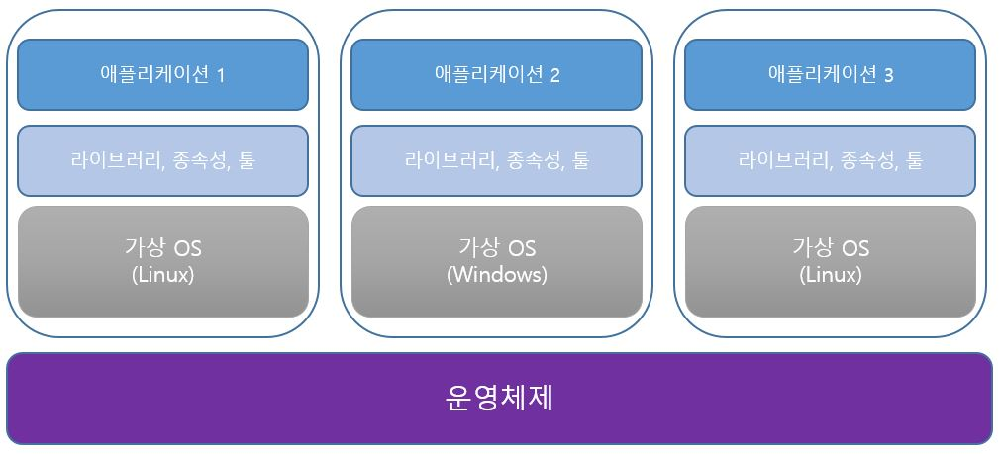
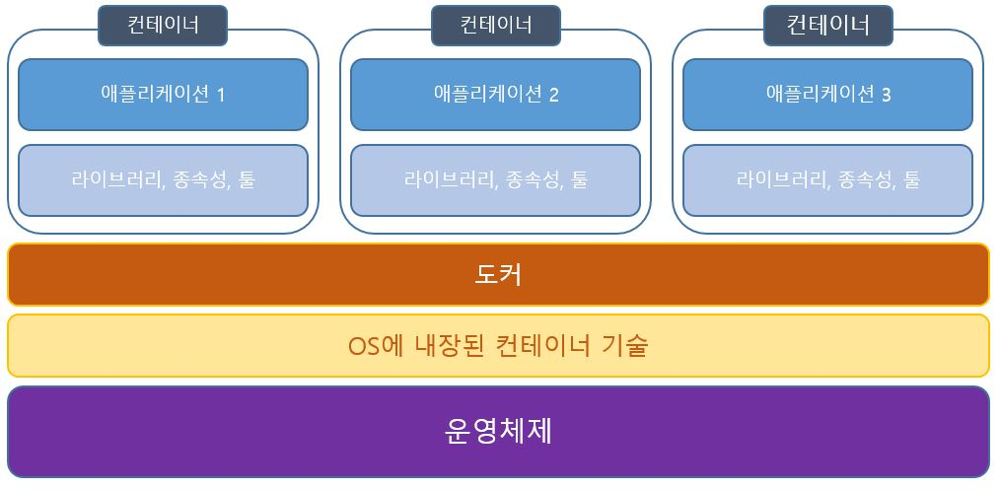

도커와 컨테이너를 알게되면, 가상 머신에 대한 비교를 하게 될 수밖에 없다.   
가상 머신으로도 컨테이너처럼 독립적인 환경을 구축해서 사용할 수 있기 때문이다.   
아래는 가상 머신과 컨테이너를 정리하고 비교한 내용이다.

## 가상 머신

가상 머신은 운영체제위에 독립된 또 다른 운영체제를 설치한다.   
그리고 그 위에 애플리케이션과 필요한 여러 라이브러리, 툴 등을 설치하게 된다.
각 가상 머신은 독립된 환경을 제공해서 입맛대로 필요한 환경을 구축해서 사용할 수 있다.
하지만, 단순히 각 애플리케이션을 독립적으로 구축하기 위해 가상 머신을 이용하는 것은 낭비다. 가상 OS도 OS이기 때문에 그만큼 많은 CPU 자원과 메모리, 디스크를 사용하게 된다.    
결국 하나의 컴퓨터 자원을 나눠쓰는 형태이기 때문에, 설치되는 가상 머신의 개수가 많아질수록 낭비되는 자원도 많아진다. 배보다 배꼽이 더 큰 상황이 연출되는 것이다.

---
### 가상머신의 장단점
|장점|단점|
|---|---|
|분리된 환경 제공|불필요한 중복된 설정, 낭비되는 공간|
|환경 별 구성|성능상 낮은 퍼포먼스|
|안정적으로 공유와 복제 가능|공유와 복제가 어려운 편|

 

## 컨테이너

가상 머신과 비교해서 컨테이너는 애플리케이션과 필요한 종속성만 갖추어지면 된다.   
그래서 가상 OS를 설치해서 환경을 구축하는것보다 자원을 덜 낭비할 수 있는 장점이 있다.   또한 컨테이너 실행에 필요한 파일과 설정값 등을 포함하고 있는 "이미지"를 사용해서 쉽게 공유하고 실행할 수 있다.

---

## 컨테이너 vs 가상머신
|도커|가상머신|
|---|---|
|운영체제에 미치는 영향이 작음,  최소한의 디스크 공간을 사용|운영체제에 미치는 영향이 큼,  많은 디스크 공간 사용|
|공유, 리빌딩, 배포가 쉬움(이미지 사용)|공유, 리빌딩, 배포 어려움|
|캡슐화된 앱과 실행 환경|캡슐화된 앱과 OS 환경|

