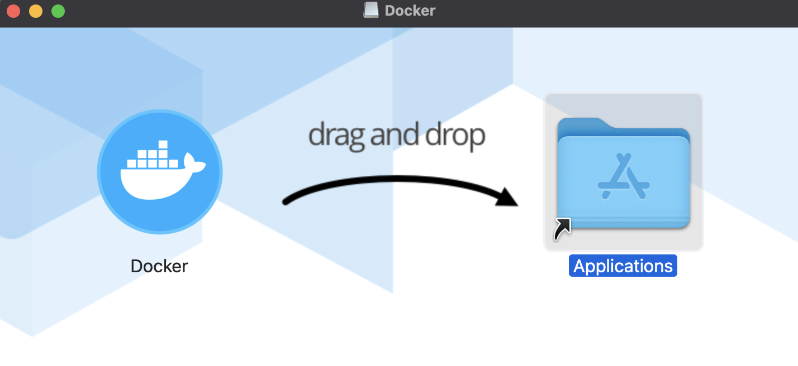

# Mac 버전 도커 설치

 

## 1. Docker 홈페이지에서 다운로드 및 설치진행

[도커 설치](https://www.docker.com/get-started)

download 버튼 클릭

설치 완료되면 드래그해서 applications 폴더로 이동

그리고 Docker 아이콘을 눌러 실행하면 된다. mac은 Unix 기반이라 그런지 Windows 보다 간편하게 설치할 수 있는 것 같다.

