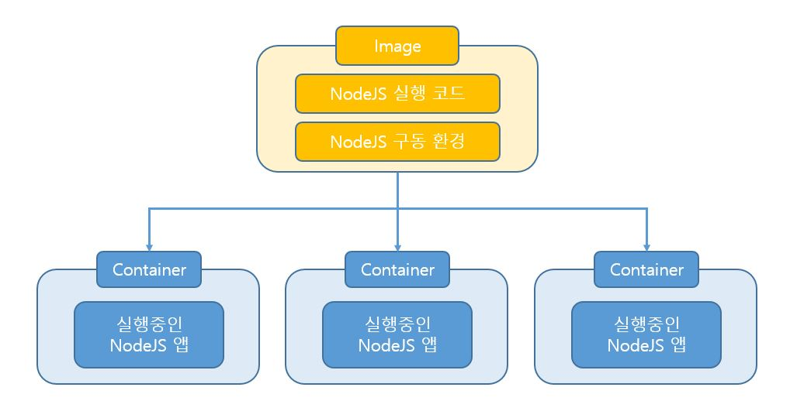

# 이미지와 컨테이너의 차이

java로 예를 들면, 이미지는 하나의 `타입`이고 컨테이너는 그 타입의 `인스턴스`이다.

 

 
 
 

--- 
## 이미지
이미지는 코드와 구동 환경을 정의해놓은 템플릿이고, 컨테이너에 대한 청사진이라고 할 수 있다. 

## 컨테이너
컨테이너는 이미지를 기반으로 구체적으로 실행되는 이미지의 인스턴스라고 할 수 있다. 
그래서 컨테이너는 이미지에 정의된 구동환경과 코드를 포함한 하나의 독립적인 소프트웨어 단위이고, 하나의 이미지로 여러개의 컨테이너를 구동할 수 있다. (이미지의 공유화 재사용화)
