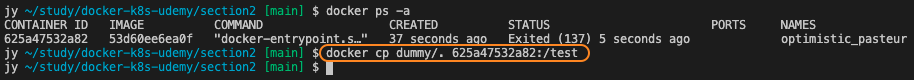
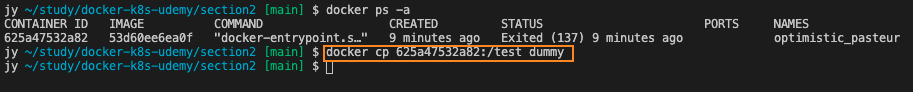
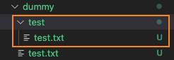

# 컨테이너로 파일 복사 & 추출

컨테이너 내부로 파일이나 폴더를 복사하거나 컨테이너 내부의 파일이나 폴더를 복사해서 추출할 수 있다.

* 명령어

```
docker cp [복사하려는 폴더 또는 파일 경로] [복사하려는 경로]

컨테이너의 경로는 [container ID or Name]:[경로] 로 작성.
```

위의 명령어를 가지고 직접 테스트해보자.

* 복사할 폴더 및 파일 생성


컨테이너 내부로 복사할 파일을 dummy 폴더와 함께 만들었다.


* 컨테이너로 복사



dummy 폴더의 모든 파일을 컨테이너의 /test 디렉토리 안으로 복사하는 명령어를 입력했다.


* 컨테이너에서 추출



dummy 의 /test 폴더를 dummy 폴더로 복사해서 추출했다.


* 컨테이너에서 추출한 폴더 및 파일 확인



dummy 폴더 안에 /test 폴더가 생긴걸 볼 수 있다.

<br/><br/>

cp 명령어를 이용하면 소스가 변경되었을 때, 이미지를 다시 빌드하지 않고 컨테이너 내부의 소스파일을 변경 해줄 수 있다. 하지만 이런 방법은 변경 범위가 크다면 변경 한 파일이 무엇인지 잊어버릴 수 있거나, 예상과 다르게 복사가 되어서 컨테이너가 망가질 수 있기 때문에 이런 방법은 쓰지 않는 것이 좋다. 대신, 웹 서버용 환경 설정 파일을 수정한다던가 컨테이너에 생성된 로그 파일들을 복사해와서 분석하거나 하는 식으로 사용하는 정도로 이용하면 좋을 것이다.