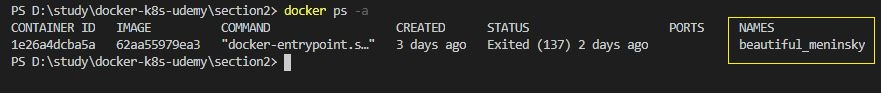
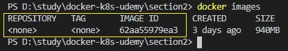
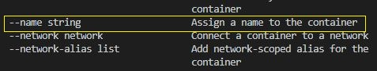
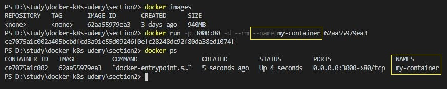
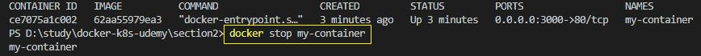
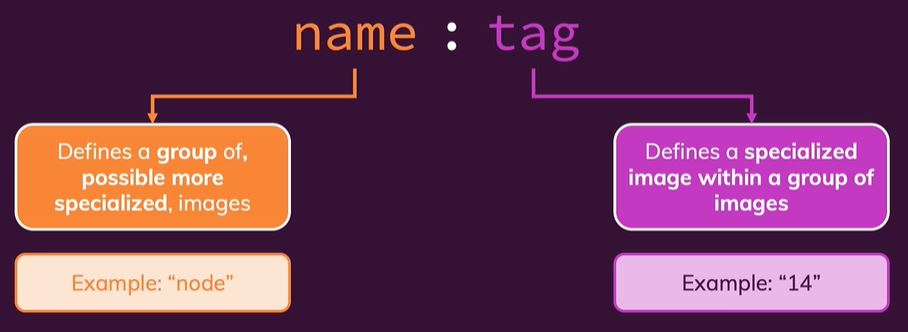
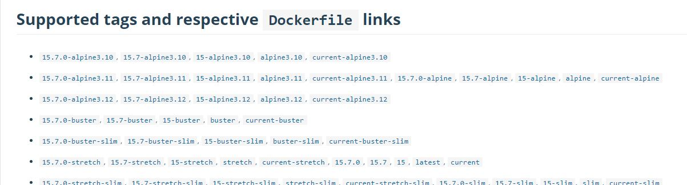
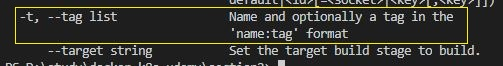
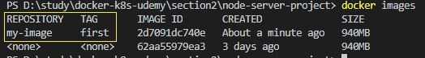
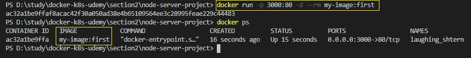

# 컨테이너 이름 및 이미지 태그 지정

이미지나 새로 빌드하거나 컨테이너를 새로 실행하면 컨테이너의 경우 알아서 이름을 생성해주고, 이미지는 이름 없이 자동으로 생성된 이미지 ID를 사용해서 조작할 수  있다. 
<br/>

<br/>
컨테이너는 자동으로 이름을 지정해준다.

<br/>
이미지는 컨테이너처럼 name이 아니라 tag와 repository로 이름을 지정하는데,
이미지를 보면 따로 지정한 이름이 없어서 tag와 repository가 none으로 나온다. 

<br/>
우리가 지정한 이름이 아니기 때문에 일일히 기억할 수가 없다. 그래서 매번 명령어를 입력할때마다 복사해서 사용해야하는 불편함이 따르게 되는데, 이럴때 직접 이름을 간단명료하게 지정해주어서 명령어를 좀 더 편하게 입력할 수 있다.

<br/><br/>

## 컨테이너 이름 지정

```
docker run --name [options] [Image ID or Name]
```

<br/>
컨테이너의 경우 `--name 옵션`을 사용해서 이름을 지정할 수 있다.<br/>

<br/>
위의 그림에서 --name 옵션으로 my-contianer을 주었다. 그 후, 실행중인 컨테이너를 출력해보니 NAMES에 옵션으로 주었던 my-contianer이 출력되는걸 확인할 수 있다.<br/>

<br/>
이제 직접 지정한 이름으로 컨테이너를 중지시킬 수 있게 되었다. 쉽게 기억할 수 있기 때문에 컨테이너를 출력해서 id나 name을 복사하는 수고를 덜 수 있게 되었다.

<br/><br/>

## 이미지 태그 지정

이미지의 tag는 두 부분으로 구성된다. 

<br/>

name : tag 로 구성되는데 콜론 좌측의 name은 이미지의 저장소(repository)라고도 하는 실제 이름이다. 이미지의 이름을 그룹화 또는 특징화 하는데 사용하며, 예를 들어 node, python 등이 있다. <br/>
콜론 우측의 tag는 선택 사항인데 그룹화된 이미지내에서도 특정 버전이나 더 구체적인 이름을 지어줄 수 있다. 예를 들어, node:12(version 12의 node), python:3(version 3의 python) 이다.


Docker Hub에서 node에 무수히 많은 tag가 있는 것을 볼 수 있다.

<br/>

이제 명령어를 살펴보면,

<br/>

```
docker build -t [options] [Dockerfile path]
```

이미지의 tag는 -t 또는 --tag 옵션으로 지정할 수 있다.<br/>


이미지의 이름으로 my-image 태그로 first를 지정해 주었다.<br/>


이미지 리스트를 출력해보면 REPOSITORY에 my-image가, TAG에 first로 출력되는것을 확인할 수 있다.<br/>


이제 직접 지정한 이미지의 이름으로 컨테이너를 생성할 수 있게 되었다.
