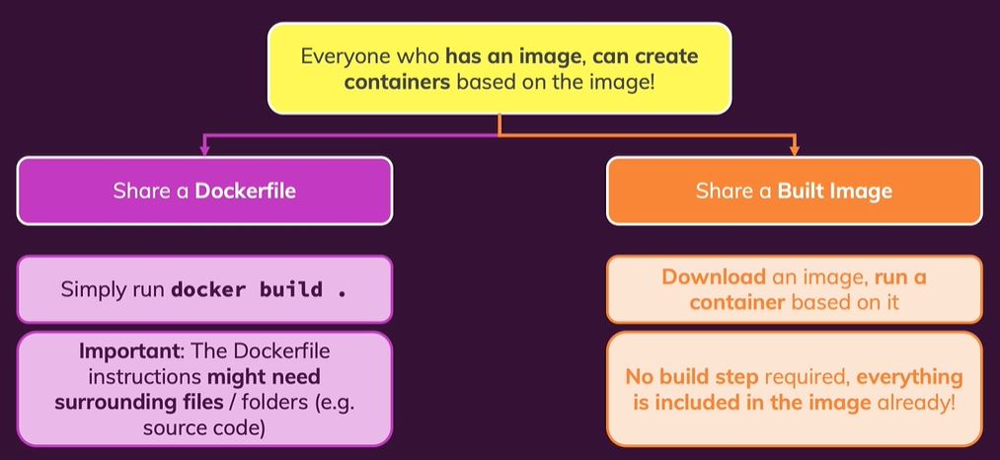

# 이미지의 공유

도커와 이미지 및 컨테이너를 사용하는 이유는 아무래도 환경에 간섭받지 않는 것과 환경과 실행 코드를 하나의 패키지로 묶어놨기때문에 쉽게 배포나 공유할 수 있는 장점이 있기 때문일 것이다. 
컨테이너는 이미지를 실행한 것이기 공유하지 않고, 결론적으로 이미지를 공유하게 된다. 아래는 이미지의 공유방법 2가지에 대한 개요를 보여준다.

이미지를 공유하는 방법에는 2가지가 있다.

**1. Dockerfile 공유**

이미지 안에 포함될 소스코드나 필요한 파일들과 함께 이미지 빌드에 대한 명령어를 담고 있는 Dockerfile을 공유하는 방법이다. 이미지를 알아서 빌드하기 때문에, 필요하면 소스코드나 Dockfile을 수정할 수 있는 장점이 있다.   

하지만, 빌드에 필요한 모든 파일을 공유해야하기 때문에 번거로울 수 있고, FROM 명령을 통해 다른 이미지를 기반으로 빌드를 한다면, 그리고 그 이미지가 로컬에 없고 Docker Hub에서 받아야하는 등의 상황(혹시 인터넷이 안되는 폐쇄망이라면)을 신경써야 할 것이다.

**2. 이미지를 공유**

빌드된 이미지 자체를 공유할 수 있다. 따라서 빌드할 필요가 없기 때문에, 추가적인 소스코드나 파일이 필요하지 않다. 그저 바로 컨테이너를 실행시키기만 하면 된다. 따라서 일반적으로 이미지를 공유하는 편이다.

