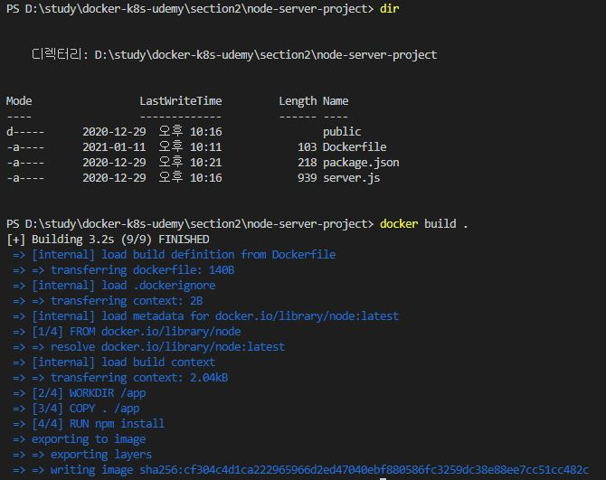
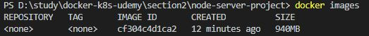
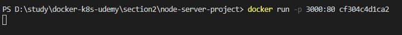
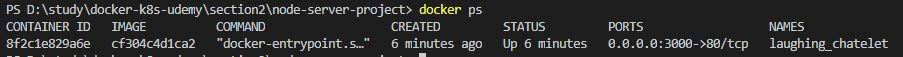
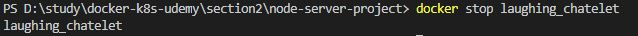

# 이미지를 빌드하고 컨테이너 실행시키기

"Building Image with a Dockerfile" 에 이어서 작업.

<br/>

## Dockerfile로 이미지 빌드하기

```
docker build [path]
```
path: Dockerfile이 위치한 디렉토리 경로

<br/>


 
그림의 제일 아래 "sha256:" 다음에 나오는 문자열이 이미지 ID가 된다.

<br/>

빌드된 이미지 리스트는 아래의 명령어로 확인할 수도 있다.
```
docker images
```


<br/>
<br/>

## 빌드된 이미지로 컨테이너 실행하기

```
docker run -p local port:container port [image ID]
```


-p 옵션은 `컨테이너를 실행시키는 시스템의 포트와 컨테이너의 포트를 매핑`시키는 옵션이다. 이 옵션을 지정하고 실행켜야 매핑한 포트를 통해서 컨테이너에서 구동중인 애플리케이션에 접근할 수 있다.<br/>
그림에선 3000포트와 컨테이너의 80포트를 매핑했다. 따라서 localhost:3000으로 접속하면 애플리케리션에 접근할 수 있다.<br/>

```
* 참고

Dockerfile의 EXPOSE 80 명령어는 엄밀히 말해서 아무것도 수행하지 않는다.
그저 문서화의 목적으로, 해당 명령을 제거할 수도 있다. 
하지만 명시적으로 작성해놓는것이 좋으며, 실질적으로는 -p옵션을 통해 80포트를 열어서 매핑시켜준다.
```


<br/>
<br/>

## 실행중인 컨테이너 확인하고 종료

**구동중인 컨테이너 확인**
```
docker ps [option]
```


뒤에 option으로 -a를 주면 이전에 실행시켰던 컨테이너 history까지 전부 보여준다.

<br/>

**컨테이너 종료**
```
docker stop [container name]
```



<br/>
<br/>
<br/>
<br/>


## ※ 이미지는 읽기 전용이다.

이미지는 한번 빌드되고나면 수정을 할 수 없다. 그래서 소스코드를 수정하더라도 이미 빌드된 이미지는 수정 전의 소스코드를 통해 빌드되었기 때문에, 영향을 받지 않는다.<br/>
즉, `소스코드를 수정하면 다시 빌드해서 새로운 이미지로 실행`시켜야 한다.