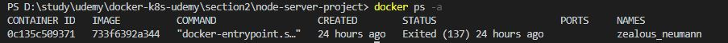
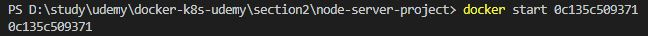
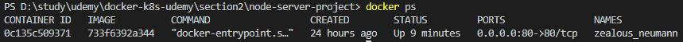

# 컨테이너 재시작

실행중인 컨테이너를 중지시키면 중지된 컨테이너 내역을 확인할 수 있다. 그 후, 수정 없이 기존 이미지로 다시 새로운 컨테이너를 구동시켜야 한다면, 그럴필요 없이 이미 종료시킨 컨테이너를 재시작시킬 수 있다.

<br/>

## 명령어

```
docker start [docker ID or name]
```

컨테이너를 재시작 하기에 앞서 이미 종료된 컨테이너를 알아야한다.<br/>
`docker ps -a` 명령으로 실행중인 컨테이너와 종료된 컨테이너까지 한번에 볼 수 있다.


<br/><br/>

이제 종료된 컨테이너를 실행시킨다.



<br/><br/>

컨테이너가 재실행 되었는지 확인




