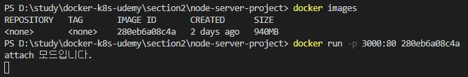
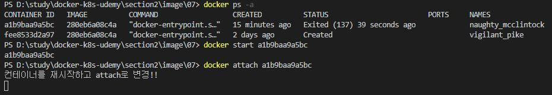
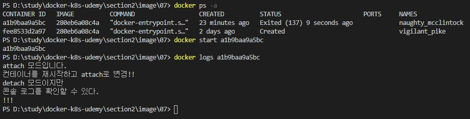
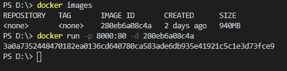

# attach & detach 모드

컨테이너를 실행하는데 있어 2가지 모드가 있다. 하나는 `foregrand 실행인 attach 모드`이고, 다른 하나는 `background 실행인 detach 모드`이다.

<br/>

## attach (포그라운드) 모드

attach 모드로 실행을 시키면 실행시킨 콘솔창이 컨테이너와 연결 상태가 된다. 그래서 컨테이너가 실행중인 애플리케이션이 출력하는 콘솔이나 로그를 볼 수가 있다.<br/><br/>

* **새로운 컨테이너를 시작했을때**

docker run 실행은 `기본적으로 attach 모드로 실행`이 된다.


위의 그림은 컨테이너를 새로 실행하고 웹에서 입력한 텍스트가 콘솔로 찍힌 화면이다.<br/>
그리고 아래의 그림은 웹의 화면이다. 웹에서 "attach 모드입니다." 라는 텍스트를 입력해서 콘솔로 console.log를 출력하는 로직을 실행시켰고, cmd창에서는 console.log를 실행한 결과가 출력되었다.


<br/><br/><br/>

* **종료된 컨테이너를 재시작할 때**

<br/>

1. attach 모드로 실행

```
docker start -a [container ID or contarner name]
```
docker start로 컨테이너를 재시작하면 `기본적으로 detach모드로 실행`이 된다.<br/> 하지만 -a 옵션을 주면 attach 모드로 실행된다.



<br/><br/>

2. detach 모드로 실행 후, attach 모드로 전환

```
docker attach [container ID or contarner name]
```


<br/><br/>

* **detach 모드 상태에서 콘솔 확인하기**

detach 모드에선 실시간이 아닌 명령어를 통해 컨테이너 내부에서 실행된 모든 console 로그를 출력할 수 있다. (컨테이너가 실행중이 아니어도 확인 가능)

```
docker logs [option] [container ID or container name]
```



컨테이너가 detach 모드로 실행중인 상태에서 option으로 -f 를 주면 로그를 출력하고 attach 모드로 전환할 수 있다.

<br/><br/>

## detach (백그라운드) 모드

* **새로운 컨테이너를 시작할 때**

```
docker run -d [options] [image ID]
```

docker run 명령어로 새로 컨테이너를 시작할 땐, 기본이 attach 모드이기 때문에 detach 명령어로 실행시키는 옵션을 줘서 실행시켜줘야한다.



<br/><br/>

* **종료된 컨테이너를 재시작할 때**

docker start 명령어로 재시작할 때, 기본적으로 detach 모드로 실행된다.


