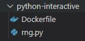
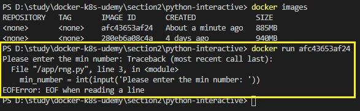
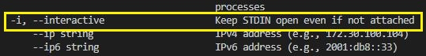
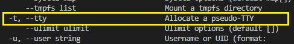
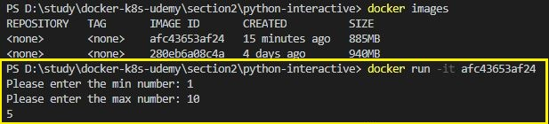
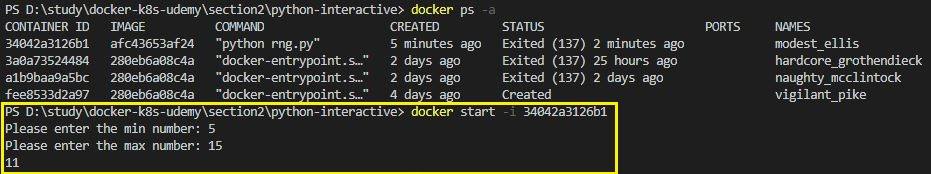

# 대화형 모드

보통 Docker는 주로 웹 개발 및 웹 서버를 실행하는데 많이 사용된다. 하지만, Docker는 이에 국한되지 않는 컨테이너 관리 기술이다.
웹 서버가 아닌 입력을 받고 출력을 하는 간단한 애플리케이션에도 사용될 수 있다.
<br/>
아래는 간단한 python 애플리케이션 소스와 Dockerfile 소스이다.

<br/><br/>

* 디렉토리 구조



<br/>

* python

```python
from random import randint

min_number = int(input('Please enter the min number: '))
max_number = int(input('Please enter the max number: '))

if (max_number < min_number):
    print('Invalid input - shutting down...')
else:
    rnd_number = randint(min_number, max_number)
    print(rnd_number)
```
최솟값과 최댓값을 입력받아서, 그 사이의 난수를 출력하는 phyhon 애플리케이션

<br/>

* Dockerfile
```Dockerfile
FROM python

WORKDIR /app

COPY . /app

CMD ["python", "rng.py"]
```
python을 기본 이미지로 구축해서 파일들을 이미지의 /app 디렉토리로 복사하는 간단한 Dockerfile<br/>
그리고 이미지를 빌드한다.

<br/><Br/>

## 대화형 모드로 컨테이너 실행



위의 그림은 컨테이너를 실행시켰지만 실패했다. 명령어를 보면 서버 애플리케이션이 아니기 때문에 포트를 주지 않고 기본 명령어로 실행시켰다. option 없이 기본 명령으로 실행시키면 attach 모드로 출력을 표시해주지만 컨테이너가 입력을 받을 수는 없다. 즉, `컨테이너와 상호작용할 수 없다.`

```
docker -it run [image ID or image Name]
```
option으로 -it를 주면 컨테이너를 대화 형 모드로 시작해서 표준 입력을 열어둘 수 있다.

옵션은 docker run --help 명령으로 확인할 수 있다.



<br/>

-i 옵션은 표준 입력을 열어서 유지하는 옵션이다.



<br/>

-t 옵션은 컨테이너에 의해 노출 된 터미널을 얻는 옵션이다. 즉, 터미널을 생성하는 옵션.



-it 옵션을 주고 대화형 모드로 실행한 결과
<br/>
옵션을 -i와 -t로 나누어서 주지않고 -it로 결합해서 사용한다.

<br/><br/>

## 대화형 모드로 컨테이너 재시작

```
docker start -i [container ID or container Name]
```



컨테이너를 재시작하는 명령 역시 마찬가지로 -i을 줘서 대화형 모드로 실행해야 한다.
-t 명령을 주지 않는 이유는, docker run으로 처음 컨테이너를 실행할 때의 option이 기억되어 있기 때문이다. (앞의 정리에서 node 서버 애플리케이션으로 처음 실행시에는 -p 옵션으로 port를 열여줬지만 재시작할땐 옵션을 주지 않았다.) 하지만 -i 옵션은 대화형 모드로 실행 하기위해 container을 재시작할 때도 필요하다.
