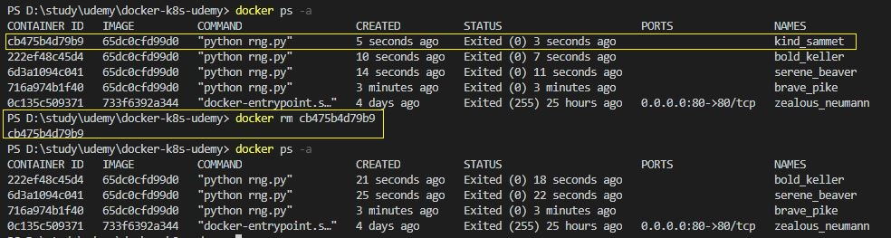
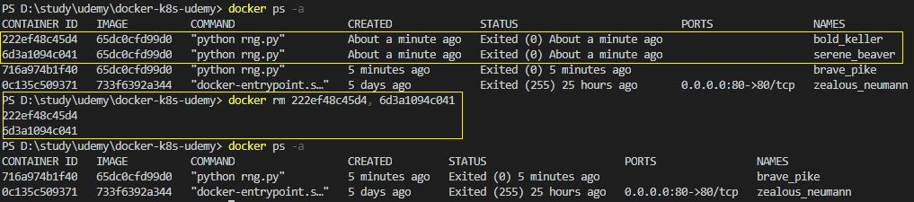
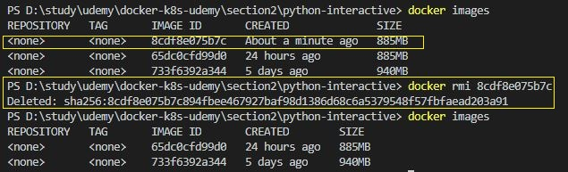
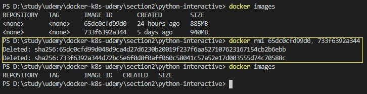
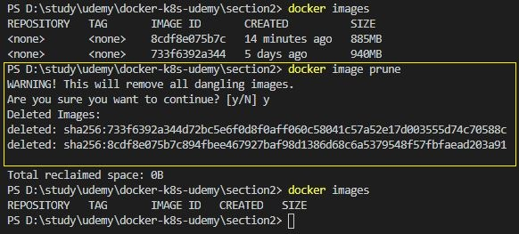

# 이미지 및 컨테이너 삭제

## 컨테이너 삭제
```
단일 삭제  :  docker rm [container ID or Name]
다중 삭제  :  docker rm [container ID or Name, Container ID or Name, ...]
```

※ 컨테이너를 삭제하기 전에 실행중이라면 컨테이너를 중지시키고 삭제해야한다.



컨테이너 단일 삭제

<br/>



컨테이너 다중 삭제

<br/>
<br/>

## 이미지 삭제
```
단일 삭제  :  docker rmi [Image ID or Name]
다중 삭제  :  docker rmi [Image ID or Name, Image ID or Name, ...]
사용하지 않는 이미지 삭제 : docker image prune
```

※ 이미지를 삭제하기 전에 그 이미지 기반의 컨테이너(실행중이거나 중지된) 존재한다면 컨테이너를 먼저 삭제해야한다.



이미지 단일 삭제

<br/>



이미지 다중 삭제

<br/>



사용하지 않는(컨테이너가 존재하지 않음) 이미지 삭제